# AI-Driven Autonomous Robot for Disaster Area Human Detection

## 📌 Project Overview
This project focuses on developing an intelligent autonomous robotic car 
for real-time disaster area analysis and human detection.

The system integrates:
- YOLO-based human detection
- Thermal image classification
- Audio-based human voice detection
- GPS location tracking
- Web-based monitoring dashboard

## 🧠 System Architecture
Camera → YOLO Model  
Thermal Sensor → CNN Model  
Microphone → Audio Classifier  
GPS Module → Location Tracking  
Web Dashboard → Survivor Monitoring  

## ⚙️ Technologies Used
- Python
- PyTorch
- YOLOv5
- Raspberry Pi 3B+
- Flask
- Sensor Fusion

## 🚀 Features
- Real-time human detection
- Multi-sensor fusion
- Survivor location mapping
- Autonomous navigation capability

## 📂 Note
Trained models and datasets are not included due to GitHub size limitations.

## 🖼 Demo

### System Architecture
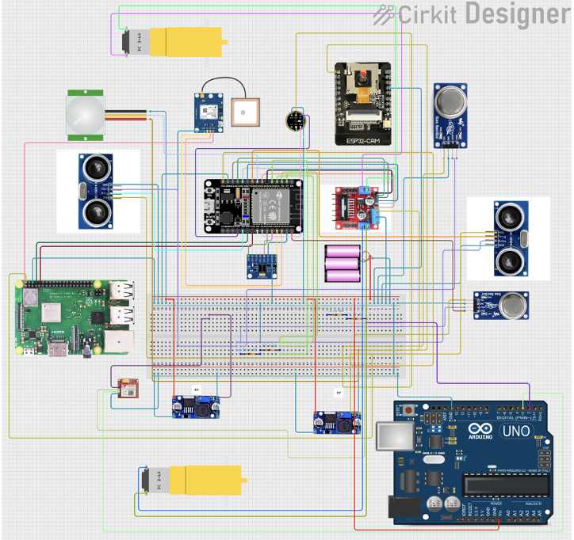

### Robot in Action
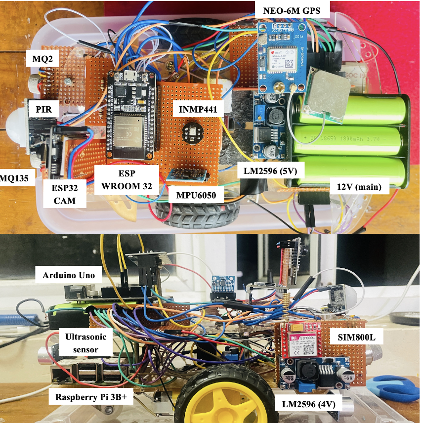
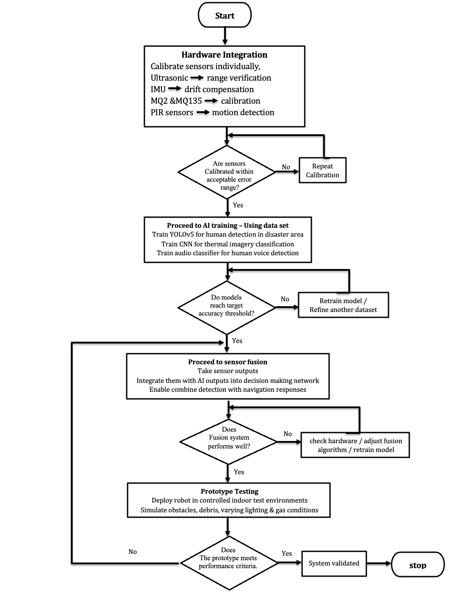
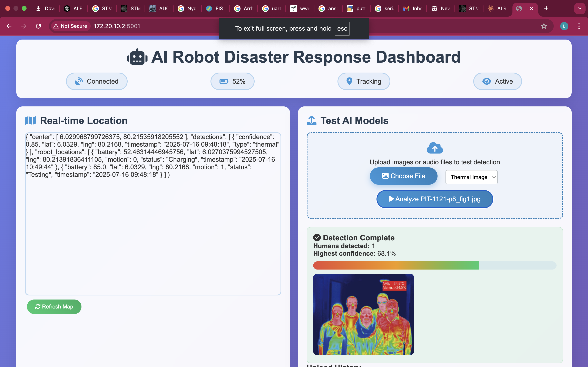
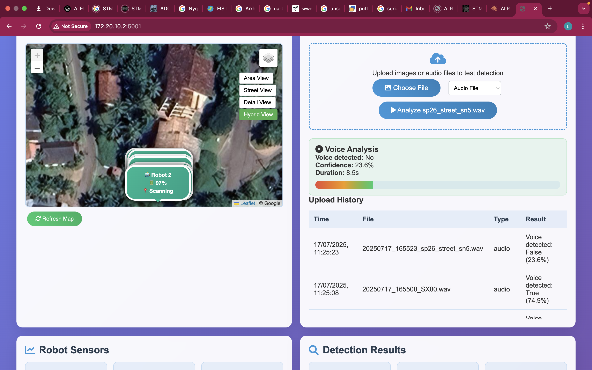
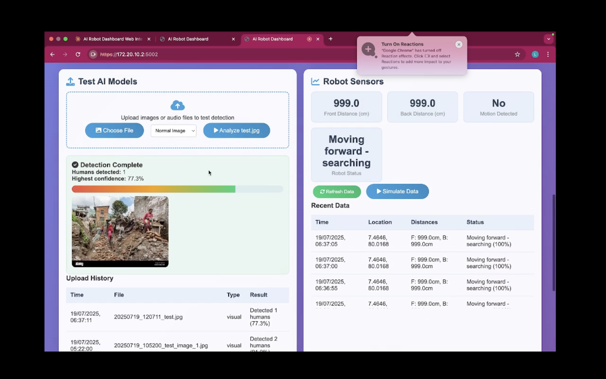
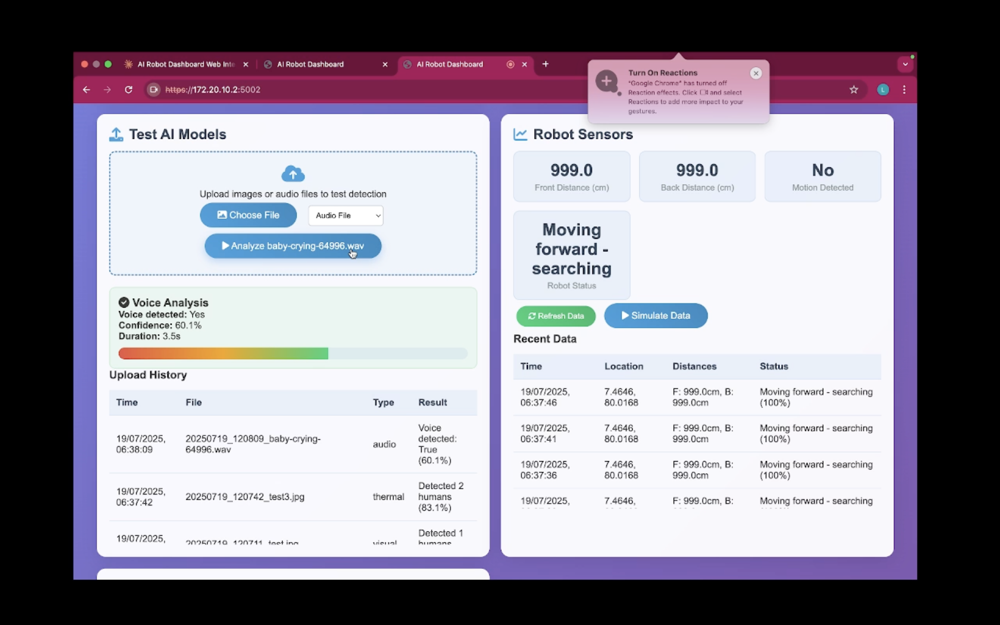
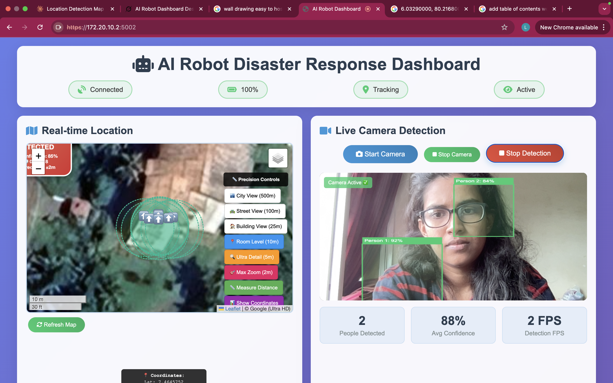

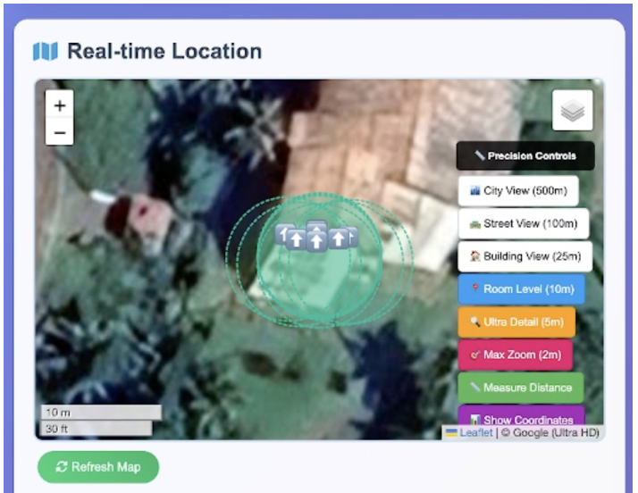

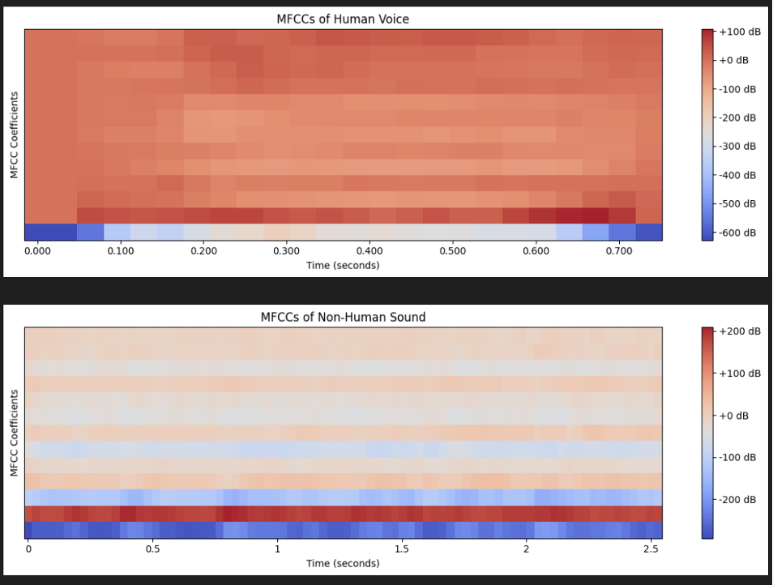

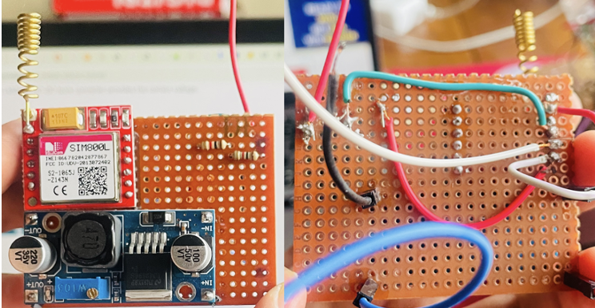

